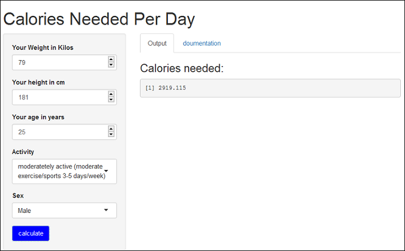

## Introduction

Calories count is a web application developed using rstudio shiny package, and hosted on shinyapps.io
The app helps you calculate the number of calories you need per day based on your age, weight, height, sex and activity.


--- 

## How To Use The App

1. Fill all the form inputs as in the picture below
2. Press Submit
3. Results are displayed on the right as shown



--- 

## How It Works

The app uses Harris Benedict Equation.
It first Calculates BMR using the variables of height, weight, age and gender to calculate the Basal Metabolic Rate:


```{}

Women: BMR = 655 + ( 9.6 x weight in kilos ) + ( 1.8 x height in cm ) - ( 4.7 x age in years )

Men: BMR = 66 + ( 13.7 x weight in kilos ) + ( 5 x height in cm ) - ( 6.8 x age in years )

```

--- 

## How It Works
The Harris Benedict Equation is a formula that uses your BMR and then applies an activity factor to determine 

your total daily energy expenditure (calories). 

```{}
If you are sedentary (little or no exercise) : Calorie-Calculation = BMR x 1.2

If you are lightly active (light exercise/sports 1-3 days/week) : Calorie-Calculation = BMR x 1.375

If you are moderatetely active (moderate exercise/sports 3-5 days/week) : Calorie-Calculation = BMR x 1.55

If you are very active (hard exercise/sports 6-7 days a week) : Calorie-Calculation = BMR x 1.725

If you are extra active (very hard exercise/sports & physical job or 2x training) : Calorie-Calculation = BMR x 1.9

```

--- 

## Code Example

Here's a code example that calculates the needed calories for a 70 kg, 25 years old, 181 cm tall, moderately active male.

```{r}

bmr <- 66 + ( 13.7 * 79 ) + ( 5 * 181 ) - ( 6.8 * 25 )

calories <- bmr * 1.55

calories

```

--- 
